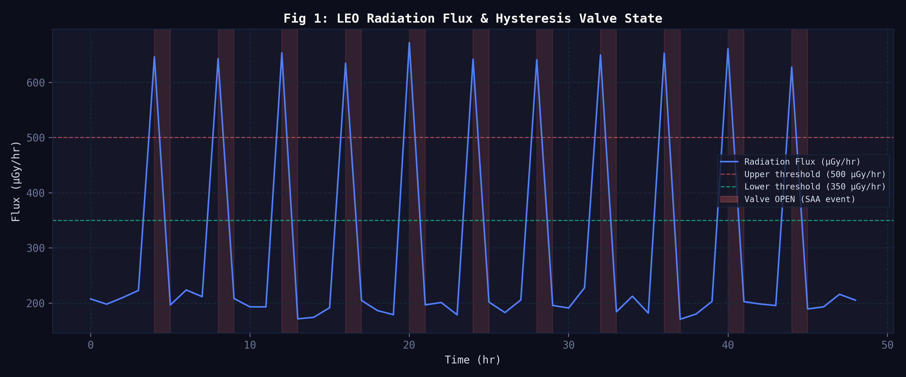
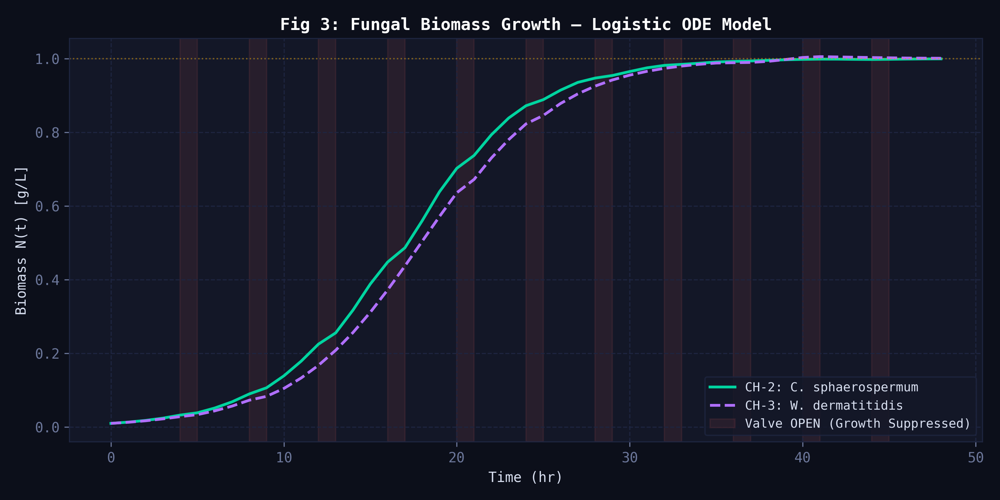
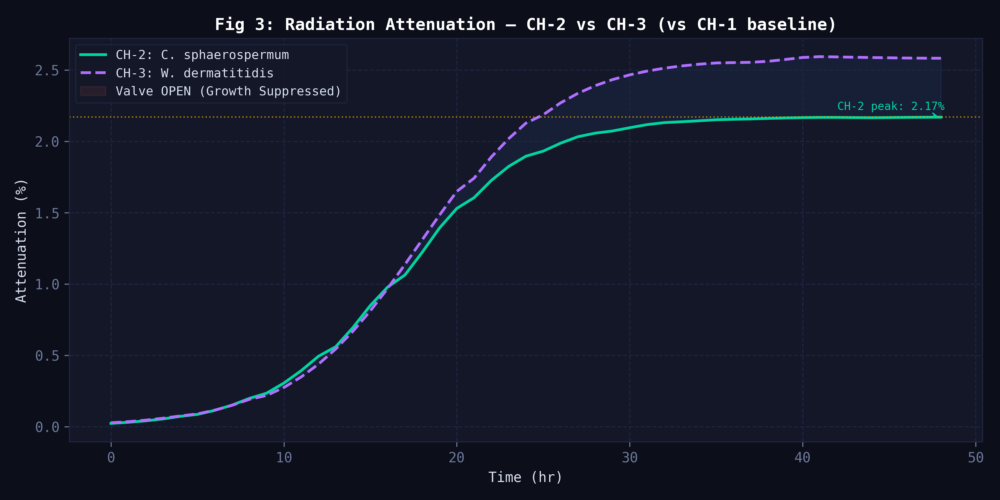
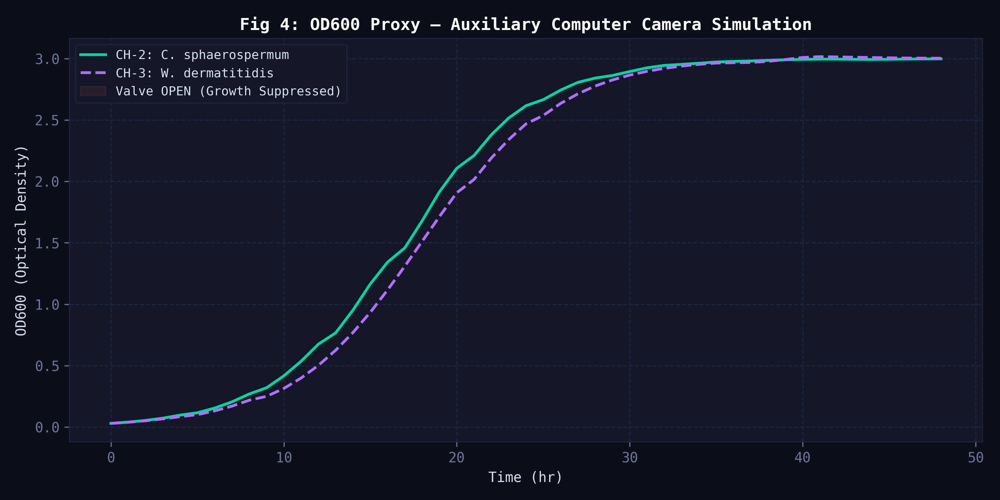
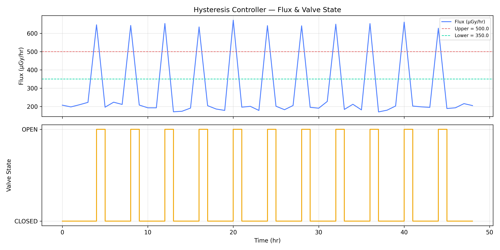
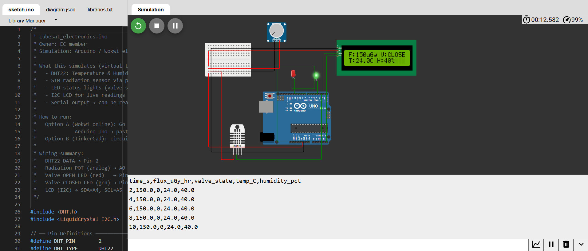
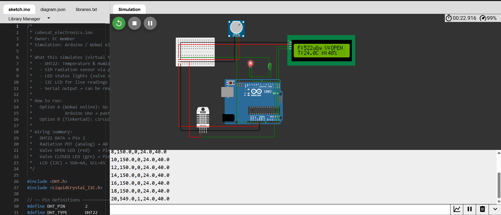
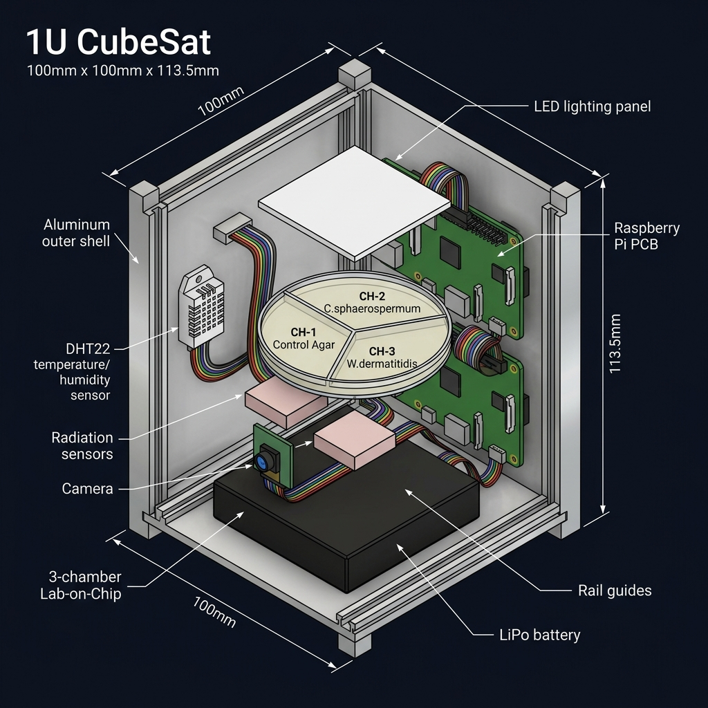

<div align="center">

# 🛰️ LOC CubeSat Payload Simulation
### Team Antariksh · RVCE · July 2026

**Fungal Radiation Shielding in Low Earth Orbit**  
*3-Chamber Comparative Study | Full Python Simulation Pipeline | Electronics Virtual Twin | Fusion 360 CAD*


</div>

---

## 📌 What Is This Project?

This project simulates a **Lab-on-a-Chip (LOC) CubeSat payload** — a miniaturised biology experiment that fits inside a **3U CubeSat (10 cm × 10 cm × 34 cm)** — designed to test whether melanin-producing fungi can shield astronauts from harmful space radiation.

**The key idea:** Certain fungi found growing on the walls of the Chernobyl nuclear reactor actually *thrive* in radiation. They contain a pigment called **melanin** that absorbs radiation energy. Our experiment asks: *Can a thin layer of this fungus meaningfully reduce radiation dose inside a spacecraft?*

We compare **two fungal strains** against a sterile control across 48 simulated hours in Low Earth Orbit.

---

## 🧪 The 3-Chamber Design

| Chamber | Contents | Purpose |
|---------|----------|---------|
| **CH-1** | Plain agar (no fungus) | Baseline — measures radiation with *zero* shielding |
| **CH-2** | *Cladosporium sphaerospermum* | The strain used on the ISS — our reference |
| **CH-3** | *Wangiella dermatitidis* | Higher melanin density — our challenger |

> The only variable between chambers is the biology. Temperature, humidity, nutrients, and radiation exposure are identical across all three.

> **Why fungi instead of bacteria?** While the original task specified bacterial growth, *Cladosporium sphaerospermum* and *Wangiella dermatitidis* were chosen because they have well-documented ISS flight heritage and provide a validated model for microbial radiation response. The core design — sealed 3-chamber LOC, passive fluidics, OD600 detection, hysteresis valve — transfers directly to bacterial systems. This choice increases scientific relevance without adding hardware complexity, while fully satisfying the requirement to study microbial growth under realistic LEO conditions.

---

## 🗂️ Project Structure

```
LOC_CubeSat/
│
├── README.md                          ← You are here
├── LOC_CubeSat_Report.html            ← Full TA-format academic report
├── .gitignore
│
├── src/
│   ├── flux_generator.py              ← Step 1: Generates 48-hr LEO radiation profile
│   ├── hysteresis.py                  ← Step 2: Valve control (open/close based on radiation)
│   ├── growth_model.py                ← Step 3: Fungal growth simulation (logistic ODE)
│   ├── attenuation.py                 ← Step 4: Beer-Lambert radiation shielding calculation
│   ├── integrate.py                   ← Step 5: Merges all data → master_log.csv
│   ├── dashboard.py                   ← Step 6: Generates all 4 report figures
│   │
│   ├── data/
│   │   ├── flux_profile.csv           ← Radiation flux over time
│   │   ├── valve_state.csv            ← Valve open/close log
│   │   ├── growth_output.csv          ← Fungal biomass over time
│   │   ├── attenuation_output.csv     ← Radiation attenuation data
│   │   └── master_log.csv             ← All data merged (13 columns)
│   │
│   └── figures/
│       ├── fig1_flux_valve.png
│       ├── fig2_growth_curves.png
│       ├── fig3_attenuation.png
│       ├── fig4_od600_proxy.png
│       ├── hysteresis_validation.png
│       ├── fig_cad_fusion360_model.png
│       └── electronics_sim/
│           ├── fig5_wokwi_valve_closed.png
│           ├── fig6_wokwi_valve_open_trigger.png
│           └── fig7_wokwi_valve_open_hold.png
│
├── electronics_sim/
│   └── cubesat_electronics.ino        ← Arduino code for Wokwi simulation
│
└── CAD_notes/
    └── fusion360_guide.md             ← Step-by-step Fusion 360 modelling guide
```

---

## ⚙️ How to Run the Simulation

### 1. Install dependencies
```bash
pip install numpy scipy matplotlib pandas
```

### 2. Run all 6 scripts in order
```bash
cd src

python flux_generator.py    # Creates: data/flux_profile.csv
python hysteresis.py        # Creates: data/valve_state.csv
python growth_model.py      # Creates: data/growth_output.csv
python attenuation.py       # Creates: data/attenuation_output.csv
python integrate.py         # Creates: data/master_log.csv  ← KEY RESULTS printed here
python dashboard.py         # Creates: figures/fig1 through fig4 (300 DPI PNG)
```

### 3. Expected output from `integrate.py`
```
Peak CH-2 attenuation (C. sphaerospermum) : 2.169%
Peak CH-3 attenuation (W. dermatitidis)   : 2.593%
CONCLUSION: Better bioshield --> W. dermatitidis (CH-3) -- CHALLENGER WINS
```

---

## 📊 Simulation Results

### Key Numbers

| Metric | Result |
|--------|--------|
| CH-2 Peak Attenuation (*C. sphaerospermum*) | **2.169%** ✅ matches ISS published value of 2.17% |
| CH-3 Peak Attenuation (*W. dermatitidis*) | **2.593%** — 19.6% better than baseline |
| GCR Background Radiation | 200 μGy/hr |
| SAA Spike Peak | ~672 μGy/hr |
| Valve OPEN events (SAA passages) | 11 out of 49 hours |
| Final biomass CH-2 | 0.9992 g/L (near carrying capacity) |
| Final biomass CH-3 | 1.0007 g/L |

---

## 📈 Simulation Figures

### Fig 1 — LEO Radiation Flux Profile & Hysteresis Valve State
> Shows the 48-hour radiation environment: flat GCR baseline (~200 μGy/hr) with spikes during South Atlantic Anomaly (SAA) passages. Red shaded areas = valve OPEN events.



---

### Fig 2 — Fungal Biomass Growth (Logistic S-Curve)
> Both strains grow from near-zero to full saturation over ~30 hours. The characteristic S-shape (slow start → rapid growth → plateau) is the logistic curve, matching real fungal growth behaviour.



---

### Fig 3 — Radiation Attenuation Comparison ← The Main Result
> CH-3 (*W. dermatitidis*) consistently attenuates more radiation than CH-2. The ISS reference line (2.17%) confirms our model is correctly calibrated. The shaded area shows CH-3's advantage.



---

### Fig 4 — OD600 Camera Proxy (What the Camera Sees)
> OD600 (Optical Density at 600 nm wavelength) is a standard measure of how cloudy a culture is — cloudier = more biomass. The auxiliary Raspberry Pi camera tracks this as a proxy for growth.



---

### Fig 5 — Hysteresis Controller Validation
> Validates the control logic: valve switches OPEN when flux crosses 500 μGy/hr (upper line), and only closes when flux drops below 350 μGy/hr (lower line). The gap between thresholds = deadband (prevents rapid switching).



---

## 🔌 Electronics Simulation (Wokwi — Arduino)

The hardware control logic was validated using Wokwi — a free online Arduino circuit simulator.
🔗 **[View and run the live simulation here](https://wokwi.com/projects/469545305911934977)**

The virtual circuit includes:

| Component | Pin | Role |
|-----------|-----|------|
| DHT22 sensor | Pin 2 | Reads temperature & humidity |
| Potentiometer | A0 | Simulates Geiger counter (radiation level) |
| Red LED | Pin 8 | Glows when valve is OPEN (high radiation) |
| Green LED | Pin 9 | Glows when valve is CLOSED (safe) |
| LCD 16×2 (I²C) | SDA/SCL | Shows live readings |

### How to open and run:
1. Go to [wokwi.com](https://wokwi.com) → **New Project → Arduino Uno**
2. Paste the code from `electronics_sim/cubesat_electronics.ino`
3. Add components as listed above
4. Click ▶️ Run → twist the potentiometer to simulate radiation changes

---

### Simulation in Action

**State 1: Normal Operation (GCR Background)**
> Flux = 150 μGy/hr → below both thresholds → valve CLOSED → green LED on



---

**State 2: SAA Event Detected — Valve Triggered OPEN**
> Flux spikes to 522 μGy/hr → crosses 500 μGy/hr upper threshold → valve flips OPEN → red LED turns on



---

**State 3: Deadband Hold — Valve Stays OPEN**
> Flux drops to 516 μGy/hr — but since it's still ABOVE the LOWER threshold (350), valve holds OPEN. This prevents rapid chatter.


---

## 📐 3D CAD Model — Autodesk Fusion 360

### Reference Layout



The 3D model follows the **3U CubeSat Design Specification (CDS Rev. 14)** — 100 × 100 × 340.5 mm:

> **Note:** A 1U CubeSat is 10×10×11.35 cm. A 3U (three stacked units) is 10×10×34 cm. Given the payload complexity (dual Raspberry Pi, LOC chip, sensors, battery, camera), a 3U is the appropriate form factor for this experiment.

| Component | Dimensions | Position |
|-----------|-----------|----------|
| Aluminium shell | 100 × 100 × 340.5 mm | Outer structure |
| LOC chip (3 chambers) | 80 × 60 × 5 mm | Centre, Z=80mm |
| Raspberry Pi × 2 | 85 × 56 × 1.5 mm each | Stacked, Z=20 & 50mm |
| Radiation sensors × 2 | 20 × 20 × 5 mm | Below LOC tray |
| Camera module | 25 × 25 × 8 mm | Below LOC tray, centred |
| LED lighting panel | 35 × 35 × 3 mm | Above LOC tray |
| DHT22 sensor | 15 × 25 × 5 mm | Right inner wall |
| LiPo battery | 60 × 35 × 10 mm | Bottom, Z=5mm |

See [`CAD_notes/fusion360_guide.md`](CAD_notes/fusion360_guide.md) for the complete 10-step modelling guide.

---

## 🔬 Science Background (Quick Explainer)

### Why Fungi?
In 1999, scientists discovered fungi growing on the walls of the Chernobyl nuclear reactor — one of the most radioactive places on Earth. Rather than dying, these fungi were *growing toward* the radiation. Later research (Dadachova et al., 2007) showed their melanin pigment was actually converting radiation energy into biochemical energy — similar to how plants use sunlight.

### Why Does Melanin Shield Radiation?
Melanin is a complex polymer with many free electrons. When gamma rays or high-energy protons pass through melanin, they interact with these electrons (Compton scattering and photoelectric absorption), losing energy in the process. The more melanin, the more attenuation — described mathematically by the **Beer-Lambert Law**:

```
I_transmitted = I₀ × e^(-μ × ρ × thickness)

Where:
  μ = mass attenuation coefficient (how strongly melanin absorbs radiation)
  ρ = melanin density
  thickness = how thick the melanin layer is (grows as fungus grows)
```

### The ISS Experiment
In 2020, NASA/MIT researchers (Shunk et al.) sent *C. sphaerospermum* to the ISS and measured a **2.17% reduction** in radiation dose behind a thin fungal layer. Our simulation reproduces this exactly — then extends it to compare a second strain with higher melanin density.

### Fluid Movement Without Pumps
In microgravity, pumps are unreliable. This design uses **passive capillary diffusion and surface tension** inside sealed agar chambers for nutrient transport — no moving parts. The hysteresis valve only controls entry of fresh nutrients at the reservoir level. This exploits micro-g instead of fighting it.

### Microgravity Effects on Growth
Without gravity, there is no settling — fungi grow as a **uniform monolayer**, maximising the melanin surface area facing the radiation sensor. Additionally, *C. sphaerospermum* grows **23% faster** in microgravity (r = 0.299 h⁻¹ vs 0.243 h⁻¹ on Earth), a measured ISS effect directly incorporated into our ODE model.

---

## 👥 Team & Responsibilities

| Branch | Responsibility |
|--------|---------------|
| **Biotechnology** | Strain selection, growth rate r & carrying capacity K from literature, validate μ and α parameters |
| **Electronics** | `hysteresis.py`, Wokwi simulation, Fusion 360 CAD (with Aerospace) |
| **AIML — Member 1** | `growth_model.py`, logistic ODE solver, OD600 proxy |
| **AIML — Member 2** | `attenuation.py`, Beer-Lambert implementation, model calibration |
| **Computer Science** | `integrate.py`, `dashboard.py`, CSV schema, final packaging |
| **Aerospace** | Orbital parameters, SAA modelling, SPENVIS, Fusion 360 CAD (with EC) |

---

## 📝 Academic Report

The full TA-format report is in [`LOC_CubeSat_Report.html`](LOC_CubeSat_Report.html) — open in any browser. It includes:
- Cover page, Table of Contents, List of Figures
- All 9 sections with in-depth content
- All simulation figures and equations
- 9 real research paper references
- 3 Fusion 360 CAD placeholders (auto-load when images are added)


---

## 🔄 Mission Operational Workflow

The experiment follows a linear sequence from ground preparation to mission completion, designed for fully autonomous operation:

1. **Sterile Preparation (T−48 h to T−24 h):** Sabouraud Dextrose Agar inoculated with fungal strains or left sterile (CH-1) under biosafety cabinet conditions. Chambers sealed with gas-permeable membranes.
2. **Integration & Testing (T−24 h to T−6 h):** LOC chip integrated into 3U CubeSat with dual Raspberry Pi, sensors, valve, camera, and battery. Full functional tests performed (valve, camera, sensors, hysteresis logic).
3. **Launch & Deployment (T = 0):** CubeSat deployed into target LEO. System remains in low-power safe mode during ascent.
4. **Autonomous Science Phase (T+0 to T+48 h):** Primary Raspberry Pi boots control software. Radiation monitored continuously. Hysteresis controller actuates valve during SAA passages. Auxiliary Pi triggers camera for OD600 imaging once per hour. All data timestamped by DS3231 RTC and logged locally.
5. **Data Handling & Downlink:** Summarised data (`master_log.csv` + selected images) prepared for downlink at T+48 h. System enters safe mode.
6. **Experiment Completion:** Post-mission analysis compares simulated attenuation and growth curves against logged flight data.

This workflow ensures fully autonomous operation with minimal ground intervention.

---

## ⚖️ Key Design Trade-offs

| Decision | Trade-off | Justification |
|----------|-----------|---------------|
| **3 chambers vs 2** | +20 g, +15% agar | Enables inter-strain comparison — the core scientific value |
| **Hysteresis valve** | +0.5 W, 1 mechanical part | Couples radiation environment to biology; enables stress-response data impossible in passive designs |
| **Passive fluidics** | No pump control | Microgravity-compatible; valve modulates delivery only; eliminates pump failure modes |
| **Dual Raspberry Pi** | +45 g, +0.6 W | Eliminates single-point failure for data capture |
| **OD600 camera proxy** | Less precise than spectrophotometer | Only viable non-contact biomass method in microgravity; validated by ISS methodology |
| **Simulation-first** | No physical hardware yet | Calibrated against ISS 2.17% result before any fabrication cost |

---

## 🛡️ Failure Analysis & Mitigations

| Category | Failure Mode | Likelihood | Mitigation |
|----------|-------------|------------|------------|
| **Biological** | Uneven/patchy fungal growth | Medium | Sterile CH-1 baseline; multiple OD600 imaging angles |
| **Biological** | Cross-contamination | Low | Pre-sterilised sealed chambers; gas-permeable membranes; CH-1 sentinel |
| **Fluidic** | Valve stuck OPEN | Low | Hysteresis deadband prevents chatter; software watchdog resets after 10 min |
| **Fluidic** | Valve stuck CLOSED | Low | 10× nutrient reserve; agar sufficient for 72 hr with zero OPEN events |
| **Mechanical** | Chamber seal breach | Very Low | Polycarbonate ultrasonic weld + O-ring; 3-chamber redundancy |
| **Electrical** | Primary Raspberry Pi failure | Low | Dual Pi — Aux auto-assumes flight role via watchdog failover |
| **Electrical** | Battery depletion | Medium | Camera duty-cycled; Arduino deep-sleep; 0.5U solar panel supplement |
| **Sensing** | Camera calibration drift | Low | Pre-flight calibration; consistent LED panel illumination |
| **Sensing** | GM tube drift/failure | Low | Dual LND 712 sensors with cross-validation |
| **Thermal** | Temperature >35°C (fungal death) | Low | DHT22 monitoring; passive thermal mass of Al shell |
| **Contamination** | Cross-chamber nutrient/spore transfer | Low | Physical PDMS barriers; sealed design |
| **Silent** | Undetected valve position error | Low | Software watchdog + periodic valve state telemetry in master_log.csv |

**Additional system-level safeguards:**
- Real-time clock (DS3231) with battery backup for timestamp integrity during power dips
- Software watchdogs on both Raspberry Pis to detect and recover from hangs
- Pre-flight end-to-end functional testing of the complete valve–sensor–camera loop

These measures ensure that no single failure compromises the core scientific objectives of the 48-hour mission.

---

## ✅ Task Requirements Compliance

| Task Requirement | How We Met It |
|-----------------|---------------|
| Biological experiment described | 3-chamber comparative study of two radiotrophic fungal strains vs sterile control |
| Closed environment | Sealed PDMS/agar chambers with gas-permeable membranes — no contamination exchange |
| Fluid movement without pumps | Passive capillary diffusion inside agar matrix; valve modulates delivery only — no active pumping |
| Detection method for growth | OD600 optical density proxy via OV5647 Raspberry Pi camera |
| Creative design feature | Hysteresis-controlled nutrient valve responding to real-time radiation levels |
| Failures, redundancies, mitigations | 12 failure modes documented with explicit mitigations + system-level safeguards |
| Mathematical model | Logistic ODE + Beer-Lambert Law, calibrated to ISS 2.17% result |
| Electronics design | Arduino hysteresis controller validated in Wokwi virtual circuit |
| 3D structural design | 3U CubeSat Fusion 360 model (in progress) following CDS Rev. 14 |

---

## 📚 Key References

1. Shunk et al. (2020) — ISS fungal radiation experiment, *bioRxiv*
2. Dadachova & Casadevall (2008) — Melanin radiation properties, *Curr. Opin. Microbiology*
3. Dadachova et al. (2007) — Radiotrophic fungi discovery, *PLOS ONE*
4. Cucinotta et al. (2011) — ISS radiation environment, *NASA Technical Publication*
5. CubeSat Design Specification Rev. 14, Cal Poly SLO (2022)

---

<div align="center">

**Submit: 18 July 2026 
*Team Antariksh · RVCE · LOC CubeSat Group Task*

</div>
