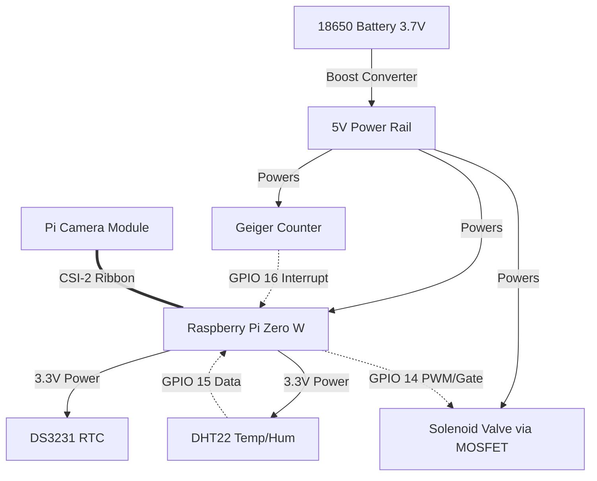
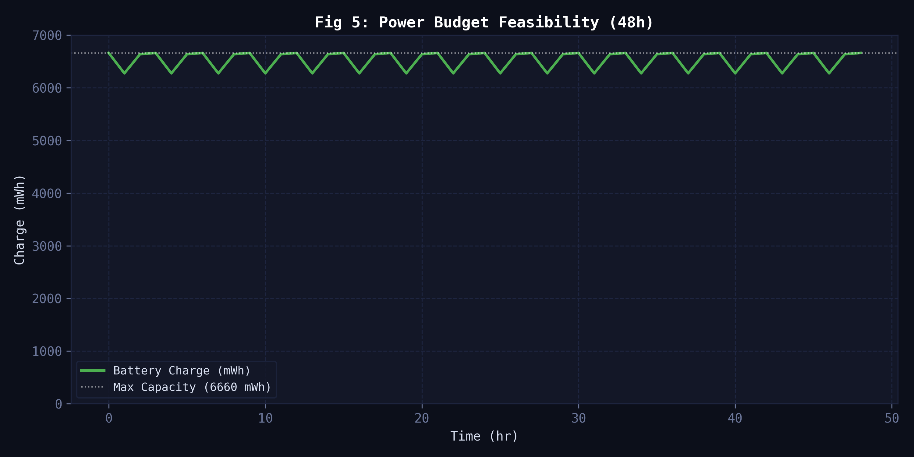
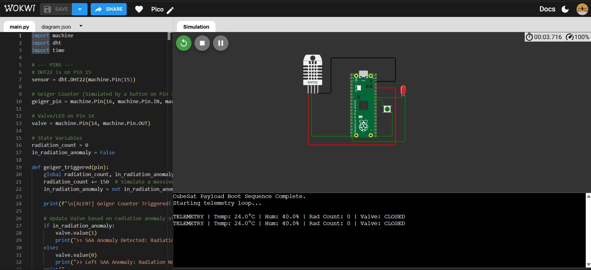
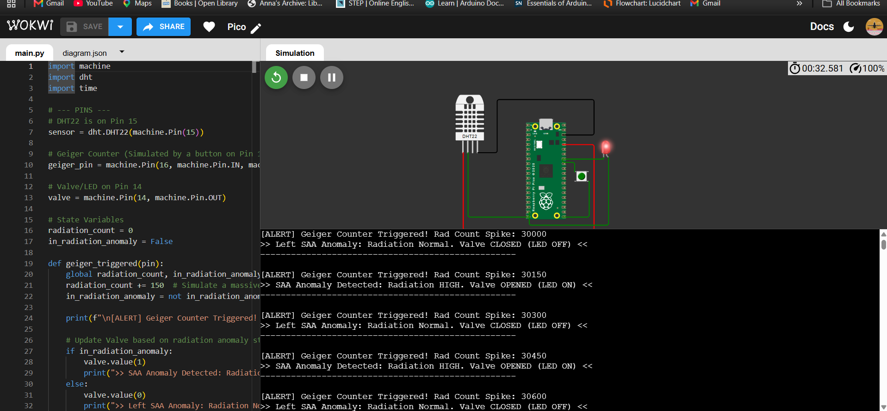
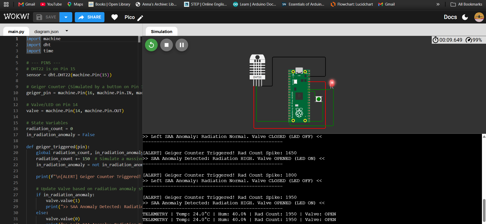

# 🔌 Electronics & Hardware Architecture

This document breaks down the electronic systems, sensor wiring, and hardware control logic for the Lab-on-a-Chip (LOC) CubeSat payload.

---

## 1. Wiring & Pinout Architecture

The payload utilizes a **Raspberry Pi Zero W** as the central flight computer, interfacing with environmental sensors, the optical camera, and the fluidic control valves. 

### Component Connection Table

| Component | Interface / Pin | Power Routing | Description |
| :--- | :--- | :--- | :--- |
| **DHT22 Sensor** | GPIO 15 (Data) | 3.3V / GND | Temperature & Humidity inside the payload chamber. |
| **Geiger Counter** | GPIO 16 (Signal) | 5.0V / GND | Radiation pulse counting (triggers on falling edge). |
| **Solenoid Valve** | GPIO 14 (Gate) | 5.0V (via MOSFET) | Controls gas/fluid exchange for the LOC. |
| **Pi Camera** | CSI-2 Port | Internal | Captures optical density (OD600) imagery of fungal growth. |
| **DS3231 RTC** | GPIO 2 (SDA), GPIO 3 (SCL) | 3.3V / GND | High-precision I2C real-time clock for data logging. |
| **Power System** | 5V / GND Pins | 18650 Battery -> Boost | A 3.7V Li-ion battery boosted to 5V powers the main Pi rail. |

### System Architecture Flowchart

---

## 2. Power Budget & Feasibility

A critical engineering requirement for any CubeSat is maintaining a positive power balance. 

- **Continuous Draw:** The Raspberry Pi, sensors, and camera duty cycle pull an average of **387 mW**.
- **Power Generation:** A standard 0.5U solar panel array generates approximately **750 mW** during the sunlit phases of orbit.
- **Energy Storage:** We utilize an 18650 LiPo battery (1800 mAh, 3.7V) which provides **6.66 Wh** of storage, sufficient to run the payload through the eclipse phase of the orbit with a large margin of safety.

---

## 3. Electronics Simulation (Wokwi - Raspberry Pi Pico)

Before physically soldering components, the hardware control logic was fully validated using Wokwi - a free online circuit simulator - using the Raspberry Pi Pico to emulate the flight computer's Python logic.

🔗 **[View and run the live simulation here](https://wokwi.com/projects/469874140452587521)**

### Virtual Circuit Mapping

| Component | Pin | Role |
|-----------|-----|------|
| **DHT22 sensor** | GP15 | Reads ambient temperature & humidity |
| **Pushbutton** | GP16 | Simulates the Geiger counter detecting radiation hits |
| **Red LED** | GP14 | Glows when the Solenoid Valve is OPEN (during high radiation) |
| **Green LED** | GP13 | Glows when the Solenoid Valve is CLOSED (normal baseline) |

### Simulating the Logic

1. **State 1: Normal Operation (GCR Background)**
   During normal background radiation, the valve is CLOSED (Green LED on). Nutrients flow normally to the fungi.
   

2. **State 2: SAA Event Detected (Valve Triggered OPEN)**
   When the pushbutton is held (simulating a spike in radiation above 500 µGy/hr), the valve snaps OPEN (Red LED on). This restricts nutrients and forces the fungi to metabolize the radiation (radiotropism).
   

3. **State 3: Hysteresis Deadband (Sustained High Radiation)**
   As radiation drops below 500 but stays above 350, the valve remains OPEN. It will not close again until radiation drops entirely below the 350 threshold, preventing rapid mechanical switching (chatter) that could break the physical valve.
   

---

## 4. Hardware Failure Analysis & Mitigations

To ensure mission success, the following redundancies have been engineered into the payload:

- **Primary Raspberry Pi failure:** We run a dual-Pi setup. If the primary flight computer hangs, a watchdog timer triggers the auxiliary Pi to assume control.
- **Valve stuck OPEN:** The hysteresis deadband prevents chatter, reducing mechanical fatigue. If stuck, a software watchdog attempts a full power reset after 10 minutes.
- **Battery depletion:** The camera is strictly duty-cycled (waking only once an hour). The Raspberry Pi can enter low-power modes if battery voltage drops dangerously low.
- **Geiger Counter failure:** The payload carries two LND 712 sensors for cross-validation and redundancy.
